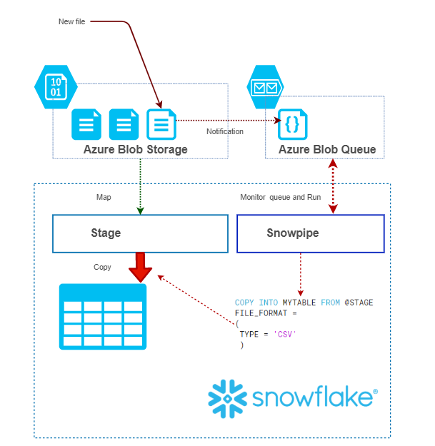

# Snowflake -snowpipe

Mechanizm **snowpipe**, który jest cześcią Snowflake umożliwia ciągłe ładowanie danych z Azure Blob Store (i Azure Data Lake Storage Gen2 przy użyciu Multi-protocol access https://docs.microsoft.com/en-us/azure/storage/blobs/data-lake-storage-multi-protocol-access ).
Mechanizm taki może być używany np. do ładowania danych z IoT Hub (Routing na Azure Blob Storage lub Azure Data Lake Storage Gen2) lub Event Hub (Capturing https://docs.microsoft.com/en-us/azure/event-hubs/event-hubs-capture-overview )
Aby skonfigurować integracje Snowflake należy wykonać kilka kroków (https://docs.snowflake.net/manuals/user-guide/data-load-snowpipe-auto-azure.html )
Na poniższym rysunku została przedstawiona koncepcja działania mechanizmu ciągłego ładowania przy użyciu **snowpipe**

