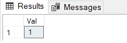

# SQL Day 2022 - Zagadki SQL

## Zadanie 1
Jaki będzie wynik poniższego zapytania:
```sql
DECLARE @t TABLE( Val INT);
DROP TABLE IF EXISTS #temp;
CREATE TABLE #temp (Val INT);

BEGIN TRAN;
	INSERT INTO @t(Val) SELECT 1;
	INSERT INTO #temp(Val) SELECT 2;
ROLLBACK TRAN;

SELECT * FROM @t
UNION ALL
SELECT * FROM #temp;
DROP TABLE IF EXISTS #temp;
```
### Wyjaśnienie:
Tutaj istotne jest zrozumienie różnic pomiędzy tabelami tymczasowymi i zmiennymi tabelarycznymi.
Jedną z istotnych różnic jest fakt, że transakcje "nie obowiązują" dla zmiennych tabelarycznych.
Zatem wycofanie transakcji nie spowoduje "wycofania" danych wstawionych do zmiennej tabelarycznej @t.
Wynikiem zapytanie będzie result set z jednym rekordem.



# Zadanie 2
Jaki będzie wynik poniższego zapytania:
```sql
DROP TABLE IF EXISTS Table1;
DROP TABLE IF EXISTS Table2;

CREATE TABLE Table1(Val INT PRIMARY KEY);
CREATE TABLE Table2(Val INT);

INSERT INTO Table1(Val) VALUES(1);

BEGIN TRAN;
INSERT INTO Table1(Val) VALUES(1);
INSERT INTO Table2(Val) VALUES(21);
COMMIT TRAN;

SELECT * FROM Table1
UNION ALL
SELECT * FROM Table2
```
### Wyjaśnienie:
Tutaj istotna jest znajomość zachowania statementu' **BEGIN TRAN - COMMIT TRAN** oraz ustawienia **[XACT_ABORT](https://docs.microsoft.com/en-us/sql/t-sql/statements/set-xact-abort-transact-sql?view=sql-server-ver16)**.
Zgodnie z dokumentacja domyślnie flaga XACT_ABORT jest wyłączona. Zatem kolejny wiersz Val=1 nie zostanie wystawiony do tabeli Table1 (Primary Key constrain)
i ta operacja wygeneruje błąd, ale następna operacja (wystawienie danych do tabeli Table2) zostanie wykonana i zatwierdzona.
Zatem wynikiem zapytanie będzie result set składający się z dwóch rekordów 1 oraz 21 


