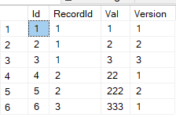
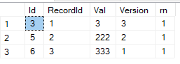

# SQL - QUALIFY

## Przygotowanie danych
W pierwszym kroku wygenerujmy przykładowe dane (SQL Server)
```sql
DROP TABLE IF EXISTS Table3;
CREATE TABLE Table3(Id INT PRIMARY KEY IDENTITY(1,1),
RecordId INT,
Val INT,
[Version] INT
);

INSERT INTO Table3(RecordId,Val,[Version])
VALUES(1,1,1),(1,2,2),(1,3,3),
    (2,22,1),(2,222,2),(3,333,1);
```
Nasze dane
```sql
SELECT * FROM Table3
```


## Zadanie
Należy dla każdego RecordId pobrać ostatnią wersję (max Version) danych

### Rozwiązanie w SQL Server
Zadanie to może zostać rozwiązane za pomocą **ROW_NUMBER** oraz **CTE**.
W CTE generujemy za pomocą funckcji ROW_NUMBER i PARTIOTION BY rn dla każdego rekordu a następie poza CTE filtrujemy CTE nakładając filtr na wynegerowany rn (filtrowanie po wygenerowanej wartości w jednym zapytaniu nie jest możliwe)
```sql
WITH CTE AS
(
 SELECT *, 
 ROW_NUMBER() OVER (PARTITION BY RecordId ORDER BY [Version] DESC) AS rn
 FROM Table3
)
SELECT * FROM CTE WHERE rn = 1
```

 
 ## Qualify
Jak to wygląda w przypadku innych silników.
W przypadku Snowflake czy Spark SQL możliwe jest filtrowanie po wartości (wygenerowanej przez funkcje okienkową) kolumny za pomocą klauzuli **QUALIFY**.
(Spark SQL Qualify)[https://docs.databricks.com/sql/language-manual/sql-ref-syntax-qry-select-qualify.html]
(Snowflake SQL Qualify) [https://docs.snowflake.com/en/sql-reference/constructs/qualify.html]

W przypadku użycia QUALIFY zapytanie wygląda następująco:
```sql
 SELECT *, 
 ROW_NUMBER() OVER (PARTITION BY RecordId ORDER BY [Version] DESC) AS rn
 FROM Table3
 QUALIFY rn = 1
```
Możliwe jest również używanie **WHERE** oraz **QUALIFY** w jednym zapytaniu
```sql
 SELECT *, 
 ROW_NUMBER() OVER (PARTITION BY RecordId ORDER BY [Version] DESC) AS rn
 FROM Table3
 WHERE RecordId IN (1,2)
 QUALIFY rn = 1
```
